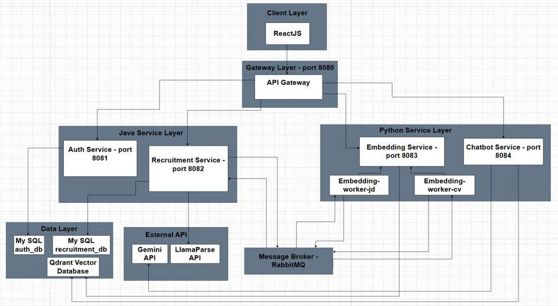
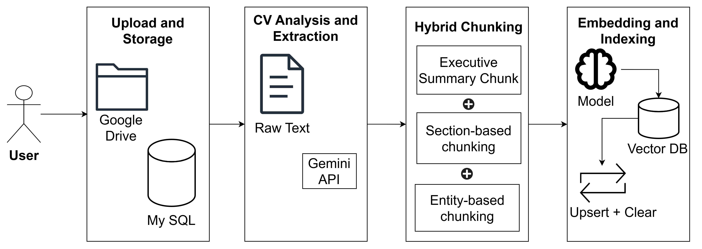
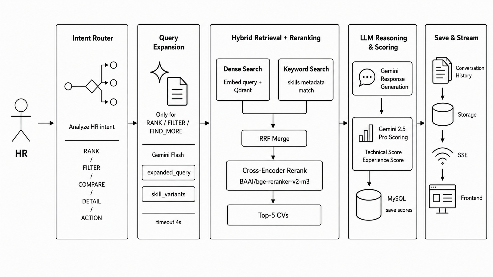
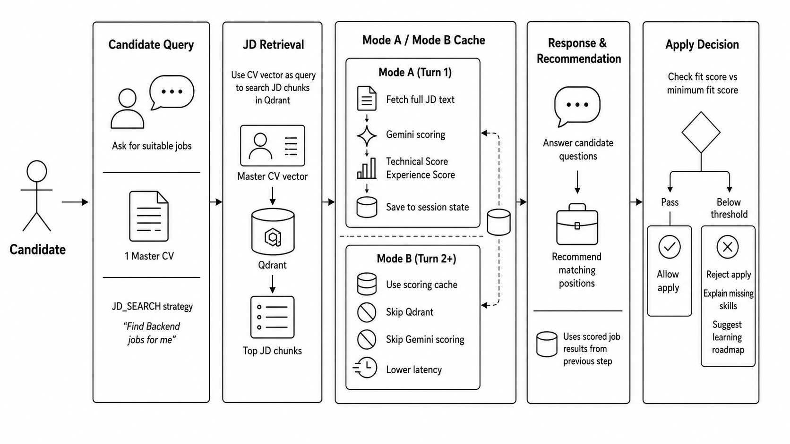
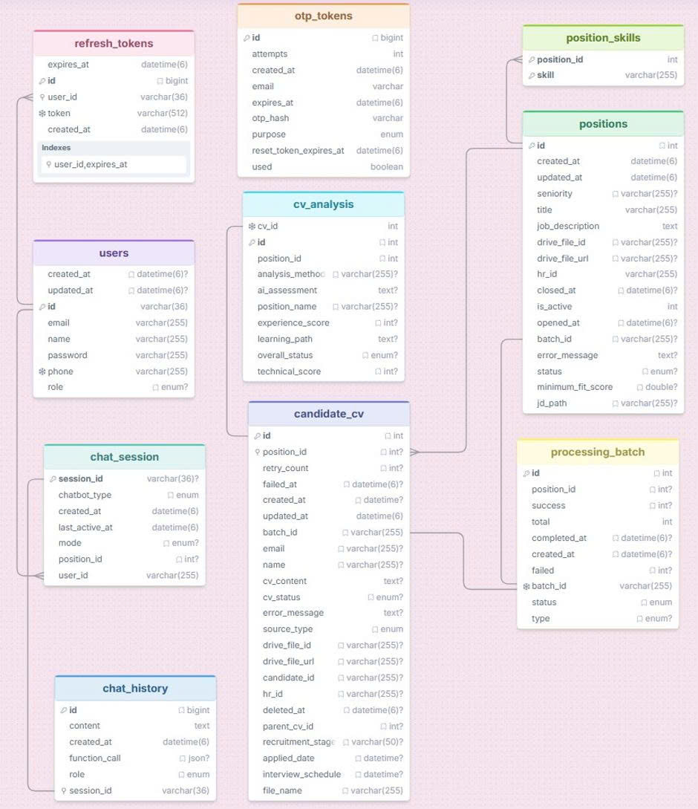

# CV Review System
> A microservices-based recruitment platform built on Java/Spring Boot, with asynchronous document-processing pipelines, JWT-secured REST APIs, and a Python/FastAPI RAG layer for AI-assisted candidate evaluation.

---

## 1. Overview

### Context
In traditional recruitment, HR departments face a severe bottleneck when screening hundreds of CVs for multiple job openings. Conversely, candidates struggle to identify positions that match their actual skills. Keyword-based matching is shallow and fails to capture the semantic complexity of professional experience. 

### Problem Solved
The **CV Review System** automates the entire candidate-to-job matchmaking lifecycle. It provides:
1. **An Internal HR Portal** for managing job positions, uploading CV pools, tracking batch processing status, analyzing candidate match scores, and interacting with an HR Chatbot to generate tailor-made interview questions and send email invites.
2. **A Candidate Portal** where job seekers upload their Master CV, interact with a Career Counselor Chatbot to find matching roles, view detailed skill gaps/learning paths, and apply directly via chat.

### My Role
This project was developed solo as a graduation project. I assumed full ownership of:
- Designing the decoupled **microservices architecture** using Java/Spring Boot and Python/FastAPI.
- Implementing the **asynchronous event-driven pipelines** using RabbitMQ.
- Designing the database schemas in MySQL and vector collections in Qdrant.
- Engineering the stateful **RAG chatbot agents** using LangGraph, LangChain, and Gemini 2.5 APIs.
- Setting up the Dockerized deployment configurations.

---

## 2. Key Features

- **Asynchronous Document Pipelines**: Offloads heavy I/O operations by processing CV/JD files asynchronously. Built with LlamaParse for high-fidelity markdown parsing and RabbitMQ for direct exchange distribution.
- **Hybrid Retrieval + Two-Stage Scoring**: Combines Dense Vector Search (Cosine Similarity) and Keyword Search on Qdrant, merges results via Reciprocal Rank Fusion (RRF), reranks with a `BAAI/bge-reranker-v2-m3` cross-encoder, then forwards only the filtered top candidates to Gemini for detailed, parallel LLM-based scoring — balancing retrieval recall against LLM cost.
- **Multi-Dimensional AI Evaluation**: Scores CVs against JDs across *Technical* and *Experience* dimensions using Gemini 2.5 models. It automatically determines fit status (`EXCELLENT_MATCH`, `GOOD_MATCH`, `POTENTIAL`, `POOR_FIT`) and generates customized skill-gap analyses.
- **LangGraph Agentic Chatbots**: Utilizes stateful LangGraph workflows with specialized intent routers to orchestrate chat flows. Built-in tools allow candidates to submit applications and HR to trigger email templates via SMTP Gmail.
- **Small-to-Big Retrieval & Data Isolation**: Stores compact vector embeddings and metadata keys in Qdrant, dynamically pulling raw texts from MySQL via secure internal APIs during the LLM reasoning stage.
- **Real-Time Communication**: Integrates Server-Sent Events (SSE) to stream chatbot response tokens and broadcast document batch processing progress.
- **Benchmarked RAG Quality, Not Just Built It**: Ran a controlled retrieval/scoring experiment (20 CVs vs. 1 JD) comparing AI output to manual HR ranking — measured `Precision@5 = 60%` at the retrieval stage and an average scoring error of only ~4 points (out of 100) once retrieval was correct, isolating the retrieval reranker — not the LLM scorer — as the main bottleneck to fix next.
- **System Metrics**:
  - **4 core microservices + 1 API Gateway + 1 shared library**, communicating over REST and RabbitMQ.
  - **50+ REST & stream endpoints** across all services.
  - **10 JPA-managed tables across 2 service-owned MySQL databases** (`auth_db`, `recruitment_db`) — a deliberate database-per-service boundary.
  - **10–25 seconds** average LlamaParse latency per CV (fully decoupled from the synchronous HTTP thread — see Challenge 1 below).
  - **~2–4 seconds** for Gemini-based metadata extraction, and **~3–5 seconds** for parallel multi-item scoring (measured 3.1s for 5 candidates, 4.6s for 5 job positions).

---

## 3. System Architecture

The system follows a microservices topology with **two independently-owned MySQL databases** (`auth_db`, `recruitment_db`) — a deliberate database-per-service boundary. External traffic enters through a Spring Cloud Gateway, which validates JWTs and routes requests either to the Java services (`auth-service`, `recruitment-service`) or, for AI-related calls, onward to the Python services (`embedding-service`, `chatbot-service`). Long-running document operations never block the request thread — they're handed off to RabbitMQ and processed asynchronously by dedicated workers.

### Overall Topology


### CV Upload & Ingestion Pipeline (Asynchronous, Event-Driven)
Parse → Chunk → Embed, decoupled via RabbitMQ so the HTTP thread returns immediately while LlamaParse/embedding workers process each file in the background.


### HR Chatbot — Search, Evaluate & Schedule
Hybrid retrieval (dense + keyword search on Qdrant, RRF-fused, cross-encoder reranked) feeding into parallel Gemini scoring, used when HR searches for or ranks candidates via chat.


### Candidate Chatbot — Job Matching & Application
Matches a candidate's Master CV against all active JDs, blocks applications below a position's minimum fit score, and explains the skill gap when a candidate is rejected.


---

## 4. Tech Stack

| Layer | Component / Technology | Version | Purpose |
| :--- | :--- | :--- | :--- |
| **Gateway & Route** | Spring Cloud Gateway | 2025.0.0 | Single entry point, JWT verification, rate limiting, and routing |
| **Backend Services** | Java / Spring Boot | 21 / 3.5.11 | Core business logic, JPA Hibernate, Virtual Threads for high-concurrency I/O |
| **AI Services** | Python / FastAPI | 3.11 / 0.109+ | Chatbot server, document ingestion API, and vector worker |
| **Agentic Framework** | LangGraph & LangChain | 0.2.x | Stateful multi-agent chatbot modeling and RAG flow orchestration |
| **Large Language Models** | Gemini 2.5 Pro / Flash | v1beta | Flash for general chat/metadata extraction; Pro for high-guardrail application scoring |
| **Embeddings & Rerank** | BAAI/bge-small-en-v1.5 / BAAI/bge-reranker-v2-m3 | - | 384-dimensional text embeddings and multilingual cross-encoder reranking |
| **Frontend** | ReactJS (Vite) | - | SPA for HR Portal & Candidate Portal; Recharts for dashboards, Zustand for global state |
| **Relational Database** | MySQL | 8.0 | Manages relational data (Users, Positions, Batches, Chat History) |
| **Vector Database** | Qdrant | Cloud / Local | Stores and performs high-speed Cosine Similarity searches on CV/JD vectors |
| **Message Broker** | RabbitMQ | 3-management | Handles asynchronous microservice communications, DLQ, and retry loops |
| **Integrations** | Google Drive / LlamaParse | - | PDF/Docx storage and intelligent markdown conversion |

---

## 5. API Documentation

Here are three key endpoints representing gateway-routed endpoints and secure internal APIs.

### 1. Batch CV Upload for HR (`Gateway Route`)
HR uploads multiple candidate CVs against a specific Position ID. The process is fully asynchronous.

- **Method**: `POST`
- **Path**: `/upload/hr/cv`
- **Headers**:
  - `Authorization`: `Bearer <JWT_ACCESS_TOKEN>`
  - `Content-Type`: `multipart/form-data`
- **Form Data**:
  - `files`: `List<MultipartFile>` (CV files: PDF, Docx)
  - `positionId`: `Integer` (Target job ID)
- **Response**:
```json
{
  "statusCode": 200,
  "message": "Batch created successfully",
  "data": {
    "batchId": "POS9_20260625_B9d2a",
    "message": "Please wait a moment. Your CVs are being processed.",
    "totalCv": 5,
    "successCount": 5,
    "status": "PROCESSING"
  },
  "timestamp": "2026-06-25T15:09:07.123"
}
```

### 2. Stream Candidate Chatbot Response (`Gateway Route`)
Streams Career Counselor response tokens to the candidate via Server-Sent Events (SSE).

- **Method**: `POST`
- **Path**: `/chatbot/candidate/chat/stream`
- **Headers**:
  - `Authorization`: `Bearer <JWT_ACCESS_TOKEN>`
  - `Content-Type`: `application/json`
- **Request Body**:
```json
{
  "session_id": "402e1c95-3b95-46ae-84fd-8d6b2f243b26",
  "query": "Tìm các công việc Backend liên quan đến Java Spring Boot và Docker cho tôi.",
  "candidate_id": "usr_cand_001",
  "cv_id": 12
}
```
- **Response** (HTTP 200, `text/event-stream`):
```text
data: {"status": "Đang tải lịch sử phiên..."}

data: {"status": "Đang tìm kiếm thông tin liên quan..."}

data: {"status": "Đang phân tích và tổng hợp kết quả..."}

...
data: {"done": true, "metadata": {"matched_positions": [9, 15]}, "fallback_answer": "Dựa trên CV của bạn..."}
```

### 3. Application Finalization (`Internal Service Endpoint`)
Secure API called by `chatbot-service` to write final match scores and establish applications.

- **Method**: `POST`
- **Path**: `/internal/chatbot/finalize-application`
- **Headers**:
  - `X-Internal-Service`: `chatbot-service` (Internal authentication secret)
  - `Content-Type`: `application/json`
- **Request Body**:
```json
{
  "candidateId": "usr_cand_001",
  "positionId": 9,
  "chatSessionId": "402e1c95-3b95-46ae-84fd-8d6b2f243b26",
  "technicalScore": 87,
  "experienceScore": 82,
  "overallStatus": "EXCELLENT_MATCH",
  "aiAssessment": "Ứng viên có nền tảng vững chắc về Spring Boot và Docker, khớp 90% yêu cầu kỹ thuật của vị trí.",
  "learningPath": "Bổ sung kiến thức nâng cao về Kubernetes để tối ưu hóa quy trình deployment."
}
```
- **Response**:
```json
{
  "statusCode": 200,
  "message": "Application finalized",
  "data": {
    "applicationId": 45,
    "candidateId": "usr_cand_001",
    "positionId": 9,
    "stage": "APPLIED"
  }
}
```

---

## 6. Database Schema

The relational schema is split across two service-owned MySQL databases: `auth_db` (users, refresh tokens, OTP verification — owned by `auth-service`) and `recruitment_db` (positions, candidate CVs, AI analysis, chat history — owned by `recruitment-service`). Below is the logical-level ERD.



### Key ENUM Reference

| Field | Possible Values |
| :--- | :--- |
| `users.role` | `HR`, `CANDIDATE` |
| `candidate_cv.source_type` | `INTERNAL`, `EXTERNAL` |
| `candidate_cv.cv_status` | `PENDING`, `EXTRACTING`, `EXTRACTED`, `CHUNKING`, `EMBEDDING`, `EMBEDDED`, `FAILED` |
| `candidate_cv.recruitment_stage` | `APPLIED`, `INTERVIEW_SCHEDULED`, `INTERVIEWED`, `OFFER`, `ACCEPTED`, `REJECTED` |
| `cv_analysis.overall_status` | `EXCELLENT_MATCH`, `GOOD_MATCH`, `POTENTIAL`, `POOR_FIT` |
| `positions.status` | `PENDING`, `PARSING`, `PARSED`, `EMBEDDING`, `EMBEDDED`, `FAILED` |
| `processing_batch.status` | `PROCESSING`, `COMPLETED`, `FAILED` |
| `processing_batch.type` | `CV_UPLOAD`, `JD_UPLOAD` |
| `chat_session.chatbot_type` | `HR`, `CANDIDATE` |
| `chat_session.mode` | `INTERNAL`, `EXTERNAL` |
| `chat_history.role` | `USER`, `ASSISTANT` |
| `otp_tokens.purpose` | `REGISTRATION`, `RESET_PASSWORD` |

---

## 7. Technical Challenges & Decisions

Here are the key engineering decisions implemented in the codebase to guarantee performance, prevent resource starvation, and optimize RAG retrieval:

### Challenge 1: Connection Pool Exhaustion under Long-Running External I/O
- **Problem**: In Spring Boot, methods annotated with `@Transactional` hold a database connection from the HikariCP pool. When processing CVs, `LlamaParseClient#parseCV` calls LlamaParse APIs and polls for results. This polling takes **15 to 75 seconds** depending on the document size. If this method is transactional, the database connection is held open during the entire network polling period. Under moderate concurrency, the connection pool is starved, causing the entire API Gateway/microservice ecosystem to freeze.
- **Solution**: Removed `@Transactional` from the main `parseCV` entry method in [LlamaParseClient.java](file:///d:/CVReview/BackEnd/recruitment-service/src/main/java/org/example/recruitmentservice/client/LlamaParseClient.java#L76-L140). The process was refactored into **two short, isolated transactions**:
  1. `markCvAsParsing()` (T1): Fetches and updates the status to `EXTRACTING`, committing immediately.
  2. *Network Call*: The file is downloaded, uploaded to LlamaParse, and polled (executed completely outside any database transaction).
  3. `saveParsedCvResult()` (T2): Commits the markdown content and updates status to `EXTRACTED` in a microtransaction.
  - *Result*: Database connection hold-time was cut down from **~45s to <50ms** per file, enabling high-concurrency ingestion.

### Challenge 2: Context Fragmentation & Semantic Loss in RAG Vector Retrieval
- **Problem**: Standard RAG splitters (like Recursive Character Text Splitter) divide text purely by token count. In a CV, this breaks project descriptions across chunk boundaries, causing the embedding model to lose vital associations (e.g., matching a technology used in Project A with its specific role). 
- **Solution**: Implemented a semantic **Hybrid Chunking Strategy** combined with **Context Enrichment** in [HybridChunkingStrategy.java](file:///d:/CVReview/BackEnd/recruitment-service/src/main/java/org/example/recruitmentservice/services/chunking/strategy/HybridChunkingStrategy.java):
  - **Section-based parsing**: Splits documents at logical markdown headers (`## Experience`, `## Skills`).
  - **Entity-based extraction**: For the `PROJECTS` section, the code extracts individual project entities to keep their descriptions whole.
  - **Context Enrichment**: Prepends crucial candidate metadata (Name, Core Skills, Experience Years) directly to the text of *every single chunk* before embedding.
  - **Executive Summary Chunk**: Generates a summarized overview as Chunk 0.
  - *Result*: Prevents context fragmentation, ensuring the embedding model retains global candidate profiles.

### Challenge 3: High Latency & Resource Cost in Multi-JD Job Matching
- **Problem**: When a candidate searches for matching jobs, their CV must be evaluated against all active Job Descriptions (JDs). Evaluating them sequentially via an LLM takes too long (e.g., 5 JDs × 3s = 15s latency) and consumes excessive API costs.
- **Solution**: Engineered a parallel evaluation flow in Python's [scoring.py](file:///d:/CVReview/BackEnd/chatbot-service/app/rag/candidate/nodes/scoring.py) using `asyncio.gather` and model tiering:
  - **Parallel Concurrency**: Asynchronously scores all filtered JDs in parallel, keeping total API latency under **5 seconds** regardless of the number of JDs (measured ~4.6s for 5 JDs vs. an estimated ~15s if scored sequentially).
  - **Model Tiering**: The intent router categorizes queries. When performing a standard search (`JD_SEARCH`), it uses the fast and cost-effective `gemini-2.5-flash` model. Only when a candidate finalizes an application (`APPLY`), where scoring accuracy acts as a critical gateway (minimum score of 70), does it call the more powerful `gemini-2.5-pro` model.
  - *Result*: Reduced LLM token costs by over 60% while maintaining high accuracy for critical operations.

---

## 8. Getting Started

### Prerequisites
- **Docker Desktop** 24.x+ & **Docker Compose** 2.x+ — all backend runtimes (Java 21, Python 3.11, MySQL, RabbitMQ, Qdrant) are bundled inside the Docker images, so a local JDK/Python install isn't required just to run the system.
- **Node.js** 18+ & npm — to run the React frontend.
- **Git**
- API keys/accounts: Gemini, LlamaParse, a Google Drive folder, and Qdrant (Cloud or local).

### 1. Clone the repository
```bash
git clone https://github.com/chiphamminh/CVReview.git
cd CVReview
```

### 2. Configure environment variables
All backend services share a single `.env` file at the root of `BackEnd/`, consumed by Docker Compose.
```bash
cd BackEnd
cp .env.example .env
```
Open `.env` and fill in your own values, e.g.:
```properties
DB_URL=jdbc:mysql://mysql:3306/recruitment_db
DB_USERNAME=root
DB_PASSWORD=password
LLAMAPARSE_API_KEY=your_llamaparse_key
GEMINI_API_KEY=your_gemini_key
RABBITMQ_USERNAME=guest
RABBITMQ_PASSWORD=guest
FOLDER_ID=your_google_drive_folder_id
QDRANT_URL=https://your-cluster.qdrant.io
QDRANT_API_KEY=your_qdrant_key
CHATBOT_INTERNAL_SECRET=chatbot-service
```
> ⚠️ Never commit `.env` — it's already excluded via `.gitignore`.

### 3. Start the backend
From `BackEnd/`:

**Option A — pull pre-built images (fastest):**
```bash
docker-compose up -d
```
**Option B — build from local source:**
```bash
docker-compose -f docker-compose-build.yml up -d --build
```

Either option will pull/build and start every container — `mysql`, `rabbitmq`, `qdrant` (if running locally), `auth-service`, `recruitment-service`, `embedding-service`, `chatbot-service`, and `api-gateway` — in dependency order on the `cv-review-network` bridge.

Check that everything is healthy:
```bash
docker-compose ps   # all services should show "Up"
```

### 4. Start the frontend
```bash
cd ../FrontEnd
npm install
npm run dev
```

### 5. Access the system

| Interface | URL |
| :--- | :--- |
| Candidate / HR Portal | http://localhost:5173 |
| RabbitMQ Management UI | http://localhost:15672 (user: `guest` / pass: `guest`) |
| Qdrant Dashboard | http://localhost:6333/dashboard |

### Stop the system
```bash
docker-compose down       # stop, keep data
docker-compose down -v    # stop and wipe all volumes
```

---

## 9. Future Improvements

1. **Distributed Caching Layer (Redis)**: Integrate Redis to cache frequently requested Job Details and candidate fit scores. This will also allow us to blacklist logged-out JWT tokens at the API Gateway level.
2. **Kubernetes Orchestration**: Create Helm charts and Kubernetes manifests to automate deployments, scaling, and rollouts of the microservices.
3. **Self-Hosted Vector DB Cluster**: Transition Qdrant to a self-hosted on-premise cluster to enhance data privacy and comply with strict corporate GDPR policies regarding candidate PII (Personally Identifiable Information).